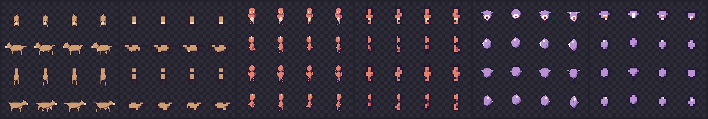

# Fablespriting

A procedural sprite generator for top-down games: 32×32 player characters
and non-humanoid enemies, animated, in 4 directions — built creature-first,
pixels-last.

**Currently in planning + spike phase.** Reading order:

1. [`CONCEPT.md`](CONCEPT.md) — the vision and the seven novel pillars
2. [`docs/ASSESSMENT.md`](docs/ASSESSMENT.md) — detailed per-pillar
   assessment, grounded in spike evidence
3. [`docs/design/`](docs/design/) — deep dives:
   [genome](docs/design/01-genome.md) ·
   [body-plan grammar](docs/design/02-bodyplan-grammar.md) ·
   [animation](docs/design/03-animation.md) ·
   [rendering & craft](docs/design/04-rendering-craft.md) ·
   [sets & export](docs/design/05-set-export.md)
4. [`docs/ROADMAP.md`](docs/ROADMAP.md) — spikes S1–S4, milestones M1–M5
5. [`docs/RISKS.md`](docs/RISKS.md) — risk register + open decisions
6. [`spikes/`](spikes/README.md) — evidence code; S1 (slab projection) is
   done and validated the core rendering bet:



*Three body plans (quadruped, biped, levitant), one renderer, 4 directions ×
4 walk frames, at 32×32 and 16×16 — all projected from a single micro-volume
model per creature.*

7. [`src/`](src/) — production code (M1, TypeScript), with tests in [`tests/`](tests/)

## Contact-sheet CLI (human QA)

The ROADMAP standing-practice QA tool. It is **not normative
rendering** — it composes the golden-tested `exportCreature()` sheets
(design 06 §6) into one review grid; the design docs pin nothing about
it, this section is its contract.

```
npm run build
node dist/cli.js sheet --seed-range 0..49 [--out DIR]     # or the
                                                          # `fablesprite`
                                                          # bin after
                                                          # npm link
```

- Renders the **sampled genome** of every seed in the inclusive range
  (design 06 §4.2 sampler, so sheets are reproducible across
  implementations) through the full pipeline, ~0.6 s per genome on a
  desktop (50 genomes ≈ 30 s — fine for a QA tool, don't put it in a
  hot loop).
- Each genome contributes its full 128×256 export sheet at 1×,
  composed row-major into `ceil(√N)` columns (capped at 31 so the
  output stays under ~4096 px wide) with a 2-px transparent gutter.
- Output: `sheet_<A>_<B>.png` + `sheet_<A>_<B>.json` in `--out`
  (default `./out`). The JSON manifest maps every grid position to
  `{seed, dna}` (plus grid geometry and `generator_version`), so
  creatures stay identifiable without in-image text — M1 renders no
  fonts.
- **Build step**: the repo is ESM TypeScript with `.js` import
  specifiers; Node 24's type stripping does not remap those onto `.ts`
  files, so the bin runs from `dist/` via `npm run build` (plain
  `tsc`, no new dependencies). CI builds before testing, which also
  arms the CLI subprocess smoke test in `tests/cli.test.ts`.
- Pinned QA sheets live in [`qa/`](qa/) (first entry:
  `sheet_0_49.png`). They **re-render on every grammar/craft change by
  design** — they are reviewed artifacts for human judgment
  (constraint row 10: the flicker gate alone is not a quality gate),
  never byte-pinned goldens.
